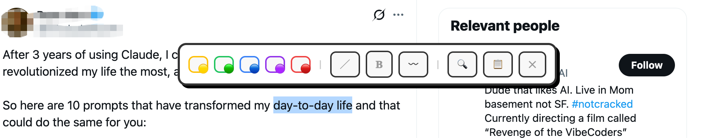
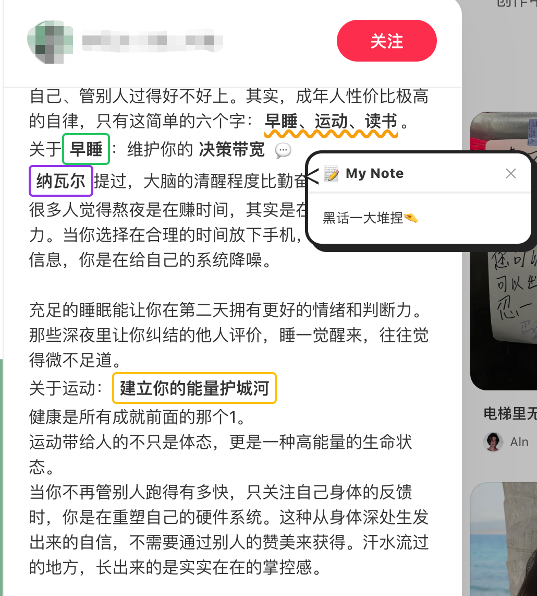
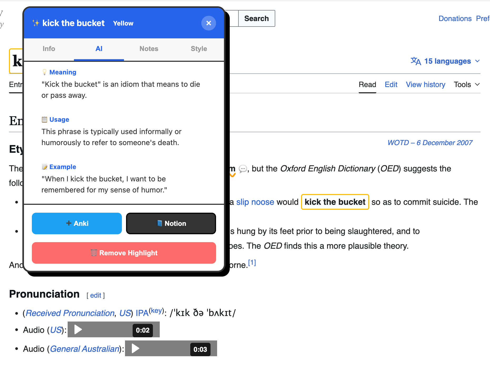
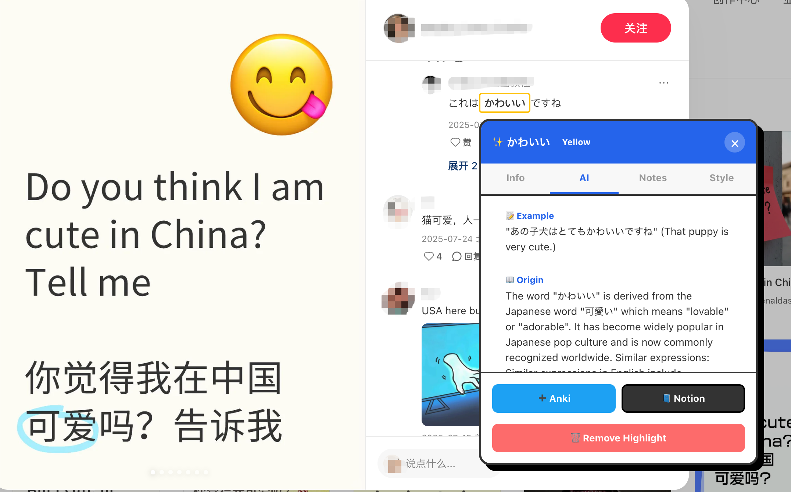
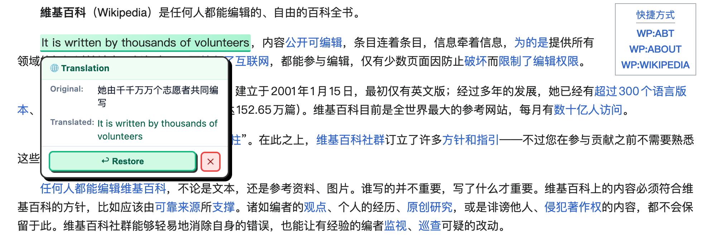
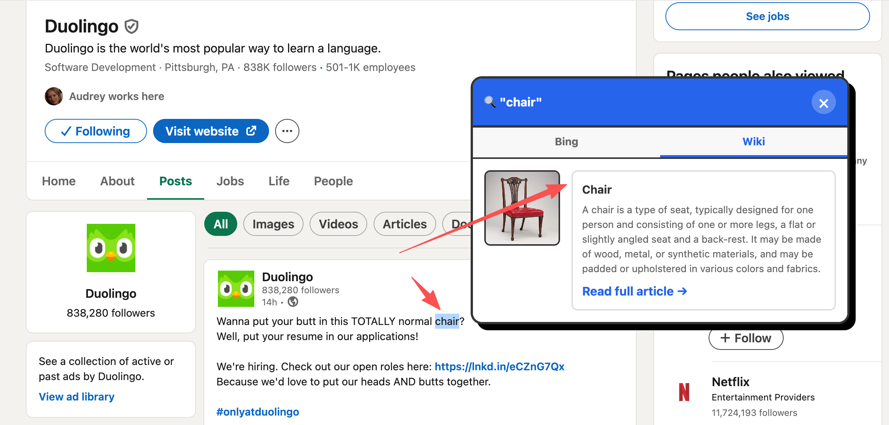

# 📚 Web Text Highlighter

A browser extension for highlighting text, getting AI-powered explanations, translating in place, and exporting to Anki and Notion — built with language learners and researchers in mind.


---

## ✨ Features

| Feature | Description |
|---|---|
| 🎨 **Text Highlighting** | Highlight any selected text in 5 colours with a floating toolbar |
| 🤖 **AI Explanations** | Get structured explanations (meaning, usage, example, origin) from 9 AI providers |
| 🌐 **In-place Translation** | Translate selected text directly on the page; click to restore original |
| 📄 **PDF Support** | Works on local and web-hosted PDF files |
| 🃏 **Anki Export** | Send highlights directly to Anki via AnkiConnect |
| 📝 **Notion Export** | Save highlights to a Notion database |
| 🔍 **Idiom Detection** | Auto-detects English idioms and phrases on page load |
| ⌨️ **Keyboard Shortcut** | `Ctrl+Shift+H` / `Cmd+Shift+H` to open the extension |

---

## Screenshots

**The basic UI is like this:**:



---

**This is how you highlight texts and make notes:**



---

**Using LMMs:**





---

**Translate and insert translation:**



---

**Search information:**



---

## 🚀 Installation

### From the ZIP file

1. Download `web-text-highlighter.zip` from this repository and unzip it.
2. Open your browser and navigate to the extensions page:
   - **Chrome**: `chrome://extensions`
   - **Edge**: `edge://extensions`
3. Enable **Developer mode** (toggle in the top-right corner).
4. Click **Load unpacked** and select the unzipped `highlighter` folder.
5. The extension icon will appear in your toolbar.

### Microsoft Edge — One-time Setup

Edge shows its own mini toolbar (Copy · Search · Share) when you select text, which overlaps with this extension's toolbar. To disable it:

1. Navigate to `edge://settings/appearance` in the Edge address bar.
2. Scroll to the **"Mini menu on text selection"** section.
3. Toggle **"Show mini menu when selecting text"** off.

---

## 🖱️ Basic Usage

### Selecting Text

Select any text on a webpage. A floating toolbar appears immediately with the following buttons:

```
🟡 🟢 🔵 🟣 🔴  |  ╱  𝐁  〰️  |  🔍  Tr  📋  ✕
```

| Button | Action |
|---|---|
| Colour dots | Highlight selected text in that colour |
| `╱` | Add a straight underline |
| `𝐁` | Bold the text |
| `〰️` | Add a wavy underline |
| `🔍` | Search the selected text on Google |
| `Tr` | Translate the selected text in place |
| `📋` | Copy the selected text to clipboard |
| `✕` | Dismiss the toolbar |

### Viewing a Highlight

Click on any highlighted word or phrase to open the **detail popup**, which shows:

- The idiom/phrase and its definition
- AI-generated explanation (meaning, usage, example, origin, similar expressions)
- Buttons to export to Anki or Notion
- A note-taking field

### Translation

1. Select any text and click **Tr** in the toolbar.
2. **First use**: A language picker dialog will appear — choose your source language (or Auto Detect) and target language. This is saved automatically for future use.
3. The selected text is replaced in place with the translation (highlighted in green).
4. **To restore the original**: click the translated text — a card appears with the original and translated versions, and a **Restore** button.
5. To change languages later, go to **Settings → Translation Settings**.

---

## ⚙️ Settings

Click the extension icon to open the settings popup. Settings are organised into five sections:

### 🤖 AI Settings

Configure the AI provider used for generating idiom explanations.

| Provider | Free Tier | Notes |
|---|---|---|
| **OpenAI** (default) | Pay-per-use | Models: `gpt-4o-mini`, `gpt-4o`, `gpt-3.5-turbo` |
| **Anthropic Claude** | Pay-per-use | Models: `claude-3-haiku`, `claude-3-5-sonnet` |
| **Google Gemini** | ✅ Free tier | Models: `gemini-1.5-flash`, `gemini-2.0-flash` |
| **DeepSeek** | ✅ Very affordable | Models: `deepseek-chat`, `deepseek-reasoner` |
| **Mistral AI** | Pay-per-use | Models: `mistral-small-latest` |
| **Groq** | ✅ Free | Models: `llama-3.1-8b-instant` — very fast |
| **OpenRouter** | Pay-per-use | Access to 200+ models |
| **Ollama** | ✅ Free (local) | Runs locally, no API key needed |
| **Custom** | — | Any OpenAI-compatible endpoint |

**Fields:**
- **AI Provider** — Select from the dropdown; fields update automatically
- **API Key** — Your key for the selected provider
- **Model** — The specific model name (pre-filled with a sensible default)
- **Prompt Template** — Customise the prompt; use `{idiom}` and `{context}` as variables

### 🌐 Translation Settings

| Field | Description |
|---|---|
| Enable translation | Toggle the Tr button on/off |
| Source Language | Language of the text you're reading (default: Auto Detect) |
| Target Language | Language to translate into (107 languages supported) |
| Translation Provider | See table below |

**Translation Providers:**

| Provider | Free | API Key Required |
|---|---|---|
| **Google Translate** (default) | ✅ Unofficial free endpoint | No |
| **MyMemory** | ✅ 1,000 words/day | No |
| **Google Cloud** | Pay-per-use | Yes |
| **Microsoft Azure** | ✅ 2M chars/month | Yes + Region |
| **DeepL** | ✅ 500K chars/month | Yes (free key ends in `:fx`) |
| **Yandex Translate** | Free tier | Yes |
| **Baidu Translate** | ✅ 1M chars/month | AppID + Secret Key |
| **LibreTranslate** | ✅ Self-hostable | Optional |
| **Custom endpoint** | — | Optional |

### 🃏 Anki Settings

Requires [AnkiConnect](https://ankiweb.net/shared/info/2055492159) to be installed in Anki.

| Field | Default | Description |
|---|---|---|
| Anki URL | `http://localhost:8765` | AnkiConnect API endpoint |
| Default Deck | `English Idioms` | Deck to save cards to |
| Card Model | `Basic` | Anki note type |

### 📝 Notion Settings

Requires a Notion integration token and a database ID.

1. Go to [notion.so/my-integrations](https://www.notion.so/my-integrations) and create an integration.
2. Share your target database with the integration.
3. Copy the **Database ID** from the database URL.

### 🔧 General

- **Auto-highlight idioms** — Automatically detect and highlight English idioms when a page loads
- **Highlight colour** — Default colour for auto-highlighted idioms

---

## 📄 PDF Support

The extension works on PDF files opened directly in the browser (both local `file://` PDFs and web-hosted `https://` PDFs).

- Select text in the PDF to get the floating toolbar
- Highlighting, AI explanations, Anki, and Notion export all work the same way

---

## 🔌 Supported AI Providers — Setup Guides

### OpenAI
1. Visit [platform.openai.com/api-keys](https://platform.openai.com/api-keys)
2. Create a new secret key
3. Paste into **Settings → AI Settings → API Key**

### Anthropic Claude
1. Visit [console.anthropic.com/settings/keys](https://console.anthropic.com/settings/keys)
2. Create an API key (starts with `sk-ant-`)
3. Paste into **Settings → AI Settings → API Key**

### Google Gemini (free)
1. Visit [aistudio.google.com/app/apikey](https://aistudio.google.com/app/apikey)
2. Create a key (starts with `AIza`)
3. Paste into **Settings → AI Settings → API Key**

### Groq (free, fast)
1. Visit [console.groq.com/keys](https://console.groq.com/keys)
2. Create a key (starts with `gsk_`)
3. Paste into **Settings → AI Settings → API Key**

### Ollama (fully local, no key needed)
1. Install Ollama from [ollama.ai](https://ollama.ai)
2. Run a model: `ollama pull llama3.2`
3. In Settings, select **Ollama**, set model to `llama3.2`
4. No API key needed

### DeepL (free 500K chars/month)
1. Sign up at [deepl.com/pro#developer](https://www.deepl.com/pro#developer)
2. Copy your Authentication Key — free keys end in `:fx`
3. Paste into **Settings → Translation Settings → API Key**

---

## 🏗️ Project Structure

```
highlighter/
├── manifest.json           # Extension manifest (Manifest V3)
├── background.js           # Service worker — context menus, AI calls, message routing
├── content.js              # Main content script — selection listener, page injection
├── styles.css              # All extension UI styles
├── onboarding.html         # First-run welcome page
├── idiom.csv               # Built-in idiom list
│
├── popup/
│   ├── popup.html          # Settings popup UI
│   ├── popup.js            # Settings load/save logic
│   └── popup.css           # Settings popup styles
│
├── lib/
│   ├── idiomParser.js      # Idiom detection and parsing
│   ├── idiomUI.js          # Floating toolbar, highlight popup, translate flow
│   ├── aiService.js        # AI API abstraction layer
│   ├── translateService.js # Translation provider abstraction (9 providers)
│   ├── notionService.js    # Notion API integration
│   ├── pdf.mjs             # PDF.js library
│   ├── pdf.worker.mjs      # PDF.js worker
│   └── pdf-viewer.js       # PDF viewer integration
│
└── icons/
    └── icon16.png
```

---

## 🔒 Permissions

The extension requests the following permissions:

| Permission | Reason |
|---|---|
| `activeTab` | Read and modify the current page's text |
| `contextMenus` | Add "Highlight as Idiom" to the right-click menu |
| `scripting` | Inject the toolbar and highlights into pages |
| `storage` | Save settings and highlights locally |
| `tabs` | Open the onboarding page on first install |
| `webNavigation` | Detect page navigation for PDF handling |
| Host permissions | Connect to AI, translation, Anki, and Notion APIs |

No data is sent to any server other than the API providers you explicitly configure. All highlights and settings are stored locally in your browser via `chrome.storage.sync`.

---

## 🗺️ Roadmap

- [ ] Firefox support
- [ ] Chrome Web Store / Edge Add-ons publication
- [ ] Sync highlights across devices
- [ ] Export highlights to CSV / Markdown
- [ ] Support for additional languages in idiom detection

---

## 🤝 Contributing

Contributions, issues, and feature requests are welcome. Please open an issue first to discuss what you'd like to change.

---

## 📜 License

MIT © [Shiyang Zheng](https://shiyangzheng.top)
